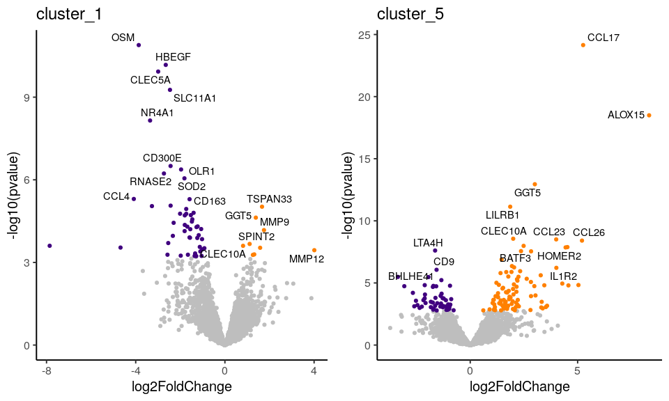
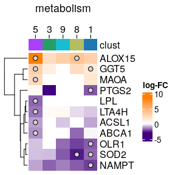
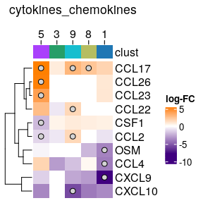

Figure 4
================

``` r
library(reticulate)
use_python("/home/nealpsmith/.conda/envs/sc_analysis/bin/python")
```

**For figure 4, we wanted to focus on differentially expressed genes between AA and AC in MPS clusters.**

To perform differential expression analyses we used `DESeq2` on a pseudobulk count matrix where we summed the UMI counts across cells for each unique cluster/sample combination, creating a matrix of n genes x (n samples \* n clusters). We used a simple model of `gene ~ phenotype` where phenotype was a factor with 2 levels indicating the phenotypical group the sample came from. When we do this for all clusters, we can see that only a subset of them have a substantial number of DEGs.

``` r
library(DESeq2)
library(glue)
library(tidyverse)

count_mtx <- as.matrix(read.csv("/home/nealpsmith/projects/medoff/data/pseudobulk_myeloid_harmonized_counts.csv",
                                row.names = 1))
meta_data <- read.csv("/home/nealpsmith/projects/medoff/data/pseudobulk_myeloid_harmonized_meta.csv", row.names = 1)
meta_data$phenotype <- factor(meta_data$phenotype, levels = c("ANA", "AA"))

# Limit to just Ag samples
meta_data <- meta_data[meta_data$sample == "Ag",]
count_mtx <- count_mtx[,rownames(meta_data)]

de_list <- list()
for (clust in unique(meta_data$cluster)){
  clust_meta <-meta_data[meta_data$cluster == clust,]
  clust_count <- count_mtx[,rownames(clust_meta)]
    if (nrow(clust_meta) > 5){

      n_samp <- rowSums(clust_count != 0)
      clust_count <- clust_count[n_samp > round(nrow(clust_meta) / 2),]

      stopifnot(rownames(clust_meta) == colnames(clust_count))

      dds <- DESeqDataSetFromMatrix(countData = clust_count,
                                    colData = clust_meta,
                                    design = ~phenotype)
      dds <- DESeq(dds)
      res <- results(dds)
      plot_data <- as.data.frame(res)
      plot_data <- plot_data[!is.na(plot_data$padj),]
      plot_data$gene <- rownames(plot_data)
      de_list[[glue("cluster_{clust}")]] <- plot_data
    }

}

de_counts <- lapply(seq_along(de_list), function(x){
    data <- de_list[[x]]
    up_aa <- nrow(data[data$padj < 0.1 & data$log2FoldChange > 0,])
    up_ana <- nrow(data[data$padj < 0.1 & data$log2FoldChange < 0,])
    info_df <- data.frame("AA" = up_aa,
                          "ANA" = up_ana, row.names = names(de_list[x]))
    return(info_df)
  }) %>%
    do.call(rbind, .)

de_counts <- de_counts[order(rowSums(de_counts), decreasing = FALSE),]

de_counts$cluster <- factor(rownames(de_counts), levels = rownames(de_counts))
plot_df <- reshape2::melt(de_counts, id.vars = "cluster") %>%
  mutate(value = ifelse(variable == "ANA", -value, value))


ggplot(plot_df, aes(x = cluster, y = value, group = variable, fill = variable)) +
  geom_bar(stat = "identity") + coord_flip() +
  scale_fill_manual(values = c("#FF8000", "#40007F")) +
  scale_y_continuous(labels = abs) +
  ggtitle(glue("Number of DE genes at Ag")) +
  ylab("# of DE genes") + xlab("") +
  theme_bw(base_size = 20)
```


In particular clusters 1 and 5 had the most differentially expressed genes. We can visualize these in a volcano plot.

``` r
library(ggrepel)
library(ggpubr)

plot_list <- lapply(c("cluster_1", "cluster_5"), function(clust){
  plot_data <- de_list[[clust]]

    # Need to limit the number of genes to label
  if (nrow(plot_data[plot_data$padj < 0.1,]) > 20 ){
    up_label <- plot_data[plot_data$padj < 0.1,] %>%
      filter(log2FoldChange > 0) %>%
      arrange(pvalue) %>%
      top_n(-20, pvalue) %>%
      .$gene
    down_label <- plot_data[plot_data$padj < 0.1,] %>%
      filter(log2FoldChange < 0) %>%
      arrange(pvalue) %>%
      top_n(-20, pvalue) %>%
      .$gene
    label_genes <- c(up_label, down_label)
  } else if(nrow(plot_data[plot_data$padj < 0.1,]) > 0 ) {
    label_genes <- plot_data[plot_data$padj < 0.1,]$gene
  } else {
    label_genes = c()
  }

  up_label <- plot_data %>%
    filter(log2FoldChange > 0) %>%
    arrange(pvalue) %>%
    top_n(-20, pvalue) %>%
    .$gene
  down_label <- plot_data %>%
    filter(log2FoldChange < 0) %>%
    arrange(pvalue) %>%
    top_n(-20, pvalue) %>%
    .$gene
  label_genes <- c(up_label, down_label)
  plot <- ggplot(plot_data, aes(x = log2FoldChange, y = -log10(pvalue))) +
    geom_point(data = plot_data[plot_data$padj > 0.1,], color = "grey") +
    geom_point(data = plot_data[plot_data$log2FoldChange > 0 & plot_data$padj < 0.1,], color = "#FF8000") +
    geom_point(data = plot_data[plot_data$log2FoldChange < 0 & plot_data$padj < 0.1,], color = "#40007F") +
    geom_text_repel(data = plot_data[plot_data$gene %in% label_genes,], aes(label = gene)) +
    ggtitle(clust) +
    theme_classic(base_size = 15)
  return(plot)
})
ggarrange(plotlist = plot_list, nrow = 1)
```

    ## Warning: ggrepel: 23 unlabeled data points (too many overlaps). Consider
    ## increasing max.overlaps

    ## Warning: ggrepel: 27 unlabeled data points (too many overlaps). Consider
    ## increasing max.overlaps



Next, we went through the lists of DEGs to look for biological patterns among the genes. We noticed many cytokines/chemokines as well as genes associated with metabolism differentially expressed at Ag. Here, we can visualize this by creating heatmaps of the log-fc of particular genes in the clusters they are differentially expressed.

``` r
library(ComplexHeatmap)
library(ggpubr)
library(circlize)

gene_lists <- list("metabolism" = c("ALOX15", "GGT5", "MAOA", "SOD2", "NAMPT", "OLR1",
                                    "ACSL1", "ABCA1", "LTA4H", "LPL", "PTGS2"),
                   "cytokines_chemokines" = c("CCL17", "CCL22", "CCL26", "CCL23", "CCL2", "CCL4",
                                              "CSF1", "OSM", "CXCL9", "CXCL10"))
plot_clusts <- c("cluster_5", "cluster_3", "cluster_9", "cluster_8", "cluster_1")

plot_list <- list()
for (gset in names(gene_lists)) {
  # Get the log-FC values for each gene in each cluster
  fc_vals <- lapply(gene_lists[[gset]], function(gene){
    log_fc_vals <- lapply(de_list, function(df){
      return(df[gene, "log2FoldChange"])
    }) %>%
      as.data.frame(., row.names = gene) %>%
      t() %>%
      as.data.frame() %>%
      rownames_to_column(var = "cluster")
    return(log_fc_vals)
  }) %>%
    reduce(left_join, by= "cluster") %>%
    column_to_rownames(var = "cluster") %>%
    t() %>%
    replace_na(0)

  p_vals <- lapply(gene_lists[[gset]], function(gene){
    log_fc_vals <- lapply(de_list, function(df){
      return(df[gene, "padj"])
    }) %>%
      as.data.frame(., row.names = gene) %>%
      t() %>%
      as.data.frame() %>%
      rownames_to_column(var = "cluster")
    return(log_fc_vals)
  }) %>%
    reduce(left_join, by= "cluster") %>%
    column_to_rownames(var = "cluster") %>%
    t() %>%
    replace_na(1)

  # Remove clusters that we do not need
  fc_vals <- fc_vals[,plot_clusts]
  p_vals <- p_vals[,plot_clusts]

  # make a list for cluster colors
  clust_cols <-list("clust" = c("cluster_1" = "#1f77b4",
                                "cluster_2" = "#ff7f0e",
                                "cluster_3" = "#279e68",
                                "cluster_4" = "#d62728",
                                "cluster_5" = "#aa40fc",
                                "cluster_6" = "#8c564b",
                                "cluster_7" = "#e377c2",
                                "cluster_8" = "#b5bd61",
                                "cluster_9" = "#17becf",
                                "cluster_10" = "#aec7e8",
                                "cluster_11" = "#ffbb78",
                                "cluster_12" = "#98df8a",
                                "cluster_13" = "#ff9896",
                                "cluster_14" = "#c5b0d5"))


  clust_annotation <- HeatmapAnnotation("names" =  anno_mark(at = 1:ncol(fc_vals),
                                                             labels = sapply(colnames(fc_vals),
                                                                             function(x) strsplit(x, "_")[[1]][2]),
                                                             which = "column", side = "top", labels_rot = 360,
                                                             link_height = unit(2.5, "mm")),
                                        "clust" = colnames(fc_vals),
                                        col = clust_cols, which = "column", show_legend = FALSE)
  clust_num_annotation <- HeatmapAnnotation(link = anno_mark(at = 1:ncol(fc_vals),
                                                             labels = colnames(fc_vals),
                                                             which = "column", side = "top"))

  # The color function
  fc_cols <- colorRamp2(c(min(fc_vals), 0, max(fc_vals)), c("#40007F", "white",  "#FF8000"))

  hmap <- Heatmap(fc_vals,
                  col = fc_cols,
                  cluster_columns = FALSE,
                  top_annotation = clust_annotation,
                  heatmap_legend_param = list(title = "log-FC"),
                  show_column_dend = FALSE,
                  show_column_names = FALSE,
                  column_title = gset,
                  cell_fun = function(j, i, x, y, width, height, fill){
                    if (p_vals[i, j] < 0.1){
                      grid.circle(x, y, r = unit(1, "mm"), gp = gpar(fill = "light grey"))
                    }
                  })
  draw(hmap)
}
```



In addition to running DESeq2 and manually curating the results, we also ran Ingenuity Pathway Analysis (IPA) to try to contextualize the differential expression results. In cluster 5, IPA suggested an up-regulation in AA of antigen processing and presentation genes. We can visualize some of these genes with violin plots compaing AA to AC at Ag.

``` python
import pegasus as pg
import matplotlib.pyplot as plt
import numpy as np
import pandas as pd
import seaborn as sns

def plot_func(genes, cluster) :
    fig, ax = plt.subplots(ncols=len(genes), nrows = 1, figsize = (7, 2))
    ax = ax.ravel()

    for num, gene in enumerate(genes) :
        mps_gene_data = pd.DataFrame.sparse.from_spmatrix(mps_ag[:, gene].X, columns=[gene],
                                                          index=mps_ag.obs_names).sparse.to_dense()
        mps_gene_data = mps_gene_data.merge(mps_ag.obs[["id", "phenotype", "new_clusters"]], how="left",
                                            left_index=True, right_index=True)
        mps_gene_data = mps_gene_data[mps_gene_data["new_clusters"] == cluster]

        # Make the plot
        sns.violinplot(x="phenotype", y=gene, hue="phenotype", data=mps_gene_data, inner=None,
                       palette={"AA": "#FF8000", "ANA": "#40007F"}, ax=ax[num], cut=0, alpha=0.5, dodge = False)
        for violin in ax[num].collections:
            violin.set_alpha(0.5)
        sns.stripplot(x="phenotype", y=gene, hue="phenotype", data=mps_gene_data,
                      palette={"AA": "grey", "ANA": "grey"},
                      dodge=False, size=2, ax=ax[num], zorder=0)
        _ = ax[num].get_legend().remove()
        _ = ax[num].set_xlabel("")
        _ = ax[num].set_ylabel("log(CPM)")
        _ = ax[num].set_title(f"{gene}")
    fig.tight_layout()
    return(fig)


mps_harmonized = pg.read_input("/home/nealpsmith/projects/medoff/data/myeloid_harmonized.h5ad")
```

    ## 2021-10-25 19:19:15,763 - pegasus - INFO - Time spent on 'read_input' = 1.12s.

``` python
mps_ag = mps_harmonized[mps_harmonized.obs["sample"] == "Ag"]
```

    ## /home/nealpsmith/.conda/envs/sc_analysis/lib/python3.7/site-packages/pandas/core/arrays/categorical.py:2487: FutureWarning: The `inplace` parameter in pandas.Categorical.remove_unused_categories is deprecated and will be removed in a future version.
    ##   res = method(*args, **kwargs)

``` python
plot_func(["CIITA", "HLA-DRB1", "CD1C"], "5")
```


In the opposite direction, IPA suggested a down-regulation in phagosome/lysosome genes in MPS cluster 5. Here are some of those genes in violin plots.

``` python
plot_func(["MARCO", "CD163", "CTSD"], "5")
```


For myeloid cluster 1, IPA suggested an up-regulation of tissue remodelling genes

``` python
plot_func(["MMP9", "ADAM19", "TSPAN33"], "1")
```


In the other direction, we saw genes associated with tissue repair up-regulated in the AC cells in cluster 1

``` python
plot_func(["HBEGF", "PLAUR", "VEGFA"], "1")
```


