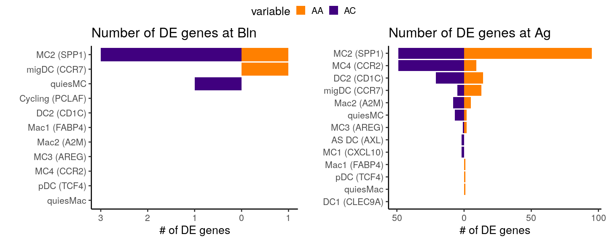
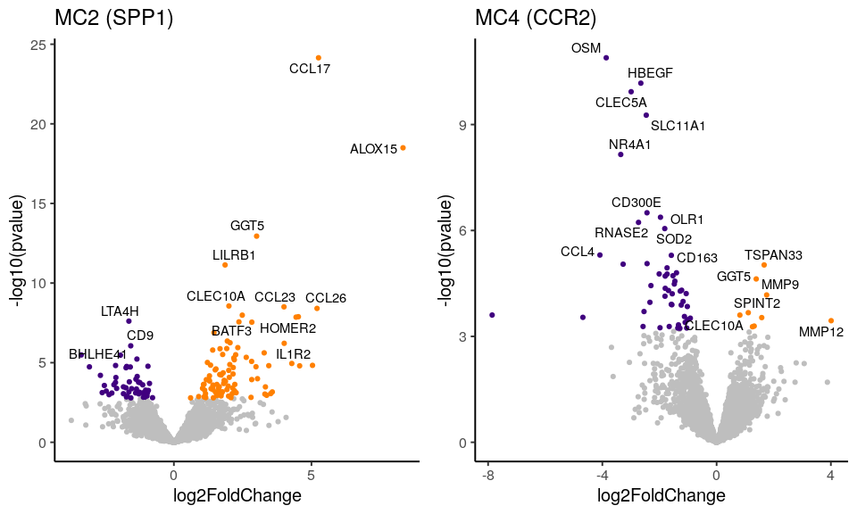
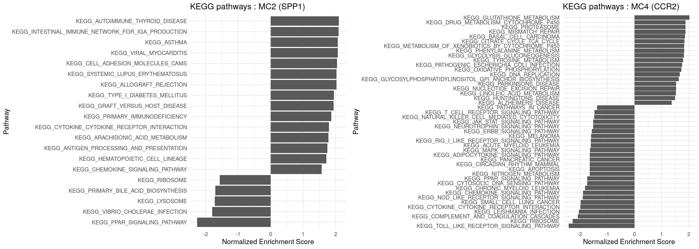

Figure 6 : DEGS & co-culture
================

``` r
library(reticulate)
use_python("/home/nealpsmith/.conda/envs/sc_analysis/bin/python")
```

**For figure 6, we wanted to focus on differentially expressed genes between AA and AC in MNP clusters. We also wanted to look at the trajectory of our MNP cells.**

To perform differential expression analyses we used `DESeq2` on a pseudobulk count matrix where we summed the UMI counts across cells for each unique cluster/sample combination, creating a matrix of n genes x (n samples \* n clusters). We used a simple model of `gene ~ phenotype` where phenotype was a factor with 2 levels indicating the phenotypical group the sample came from. When we do this for all clusters, we can see that only a subset of them have a substantial number of DEGs. More specifically, large phenotypic differences seemed to only be found after allergen challenge.

``` r
library(DESeq2)
library(glue)
library(tidyverse)
library(ggpubr)

count_mtx <- as.matrix(read.csv("/home/nealpsmith/projects/medoff/data/anndata_for_publication/pseudobulk_mnp_harmonized_counts.csv",
                                row.names = 1))
meta_data <- read.csv("/home/nealpsmith/projects/medoff/data/anndata_for_publication/pseudobulk_mnp_harmonized_meta.csv", row.names = 1)

# Fix outdated nomenclature that we did not use in manuscript
meta_data$phenotype <- as.character(meta_data$phenotype)
meta_data$phenotype[meta_data$phenotype == "ANA"] <- "AC"
meta_data$phenotype <- factor(meta_data$phenotype, levels = c("AC", "AA"))

meta_data$sample <- as.character(meta_data$sample)
meta_data$sample[meta_data$sample == "Pre"] <- "Bln"

# Need to add the annotations
annotations = c("1" = "MC1 (CXCL10)",
                   "2" = "MC2 (SPP1)",
                   "3" = "MC3 (AREG)",
                   "4" = "Mac1 (FABP4)",
                   "5" = "quiesMac",
                   "6" = "quiesMC",
                   "7" = "Cycling (PCLAF)",
                   "8" = "MC4 (CCR2)",
                   "9" = "Mac2 (A2M)",
                   "10" = "pDC (TCF4)",
                   "11" = "migDC (CCR7)",
                   "12" = "DC1 (CLEC9A)",
                   "13" = "DC2 (CD1C)",
                   "14" = "AS DC (AXL)")

plot_list <- list()
ag_de_list <- list() # Also going to save the allergen results for later on
for (samp in c("Bln", "Ag")){
  de_list <- list()
  # Limit to just given samples
  meta_temp <- meta_data[meta_data$sample == samp,]
  count_mtx <- count_mtx[,rownames(meta_data)]

  for (clust in unique(meta_data$cluster)){
    clust_meta <-meta_temp[meta_temp$cluster == clust,]
    clust_count <- count_mtx[,rownames(clust_meta)]
    if (nrow(clust_meta) > 5){
      n_samp <- rowSums(clust_count != 0)
      clust_count <- clust_count[n_samp > round(nrow(clust_meta) / 2),]

      stopifnot(rownames(clust_meta) == colnames(clust_count))

      dds <- DESeqDataSetFromMatrix(countData = clust_count,
                                    colData = clust_meta,
                                    design = ~phenotype)
      dds <- DESeq(dds)
      res <- results(dds)
      plot_data <- as.data.frame(res)
      plot_data <- plot_data[!is.na(plot_data$padj),]
      plot_data$gene <- rownames(plot_data)
      de_list[[glue("cluster_{clust}")]] <- plot_data
      if (samp == "Ag"){
        ag_de_list[[glue("cluster_{clust}")]] <- plot_data
      }

    }

  }

  de_counts <- lapply(seq_along(de_list), function(x){
    data <- de_list[[x]]
    up_aa <- nrow(data[data$padj < 0.1 & data$log2FoldChange > 0,])
    up_ac <- nrow(data[data$padj < 0.1 & data$log2FoldChange < 0,])
    info_df <- data.frame("AA" = up_aa,
                          "AC" = up_ac, row.names = names(de_list[x]))
    return(info_df)
  }) %>%
    do.call(rbind, .)

  de_counts <- de_counts[order(rowSums(de_counts), decreasing = FALSE),]

  de_counts$cluster <- factor(rownames(de_counts), levels = rownames(de_counts))
  plot_df <- reshape2::melt(de_counts, id.vars = "cluster") %>%
    mutate(value = ifelse(variable == "AC", -value, value))

  plot_df$annotation <- sapply(plot_df$cluster, function(x) annotations[sub("cluster_",
                                                                            "", x)])

  annot_order <- plot_df %>%
    dplyr::group_by(annotation) %>%
    summarise(n_total = sum(abs(value))) %>%
    arrange(desc(n_total)) %>%
    .$annotation
  plot_df$annotation <- factor(plot_df$annotation, levels = rev(annot_order))

  p <- ggplot(plot_df, aes(x = annotation, y = value, group = variable, fill = variable)) +
    geom_bar(stat = "identity") + coord_flip() +
    scale_fill_manual(values = c("#FF8000", "#40007F")) +
    scale_y_continuous(labels = abs) +
    ggtitle(glue("Number of DE genes at {samp}")) +
    ylab("# of DE genes") + xlab("") +
    theme_classic(base_size = 20)
  plot_list <- c(plot_list, list(p))
}


ggarrange(plotlist = plot_list, common.legend = TRUE)
```



In particular the MC2 and MC4 clusters had the most differentially expressed genes. We can visualize these in a volcano plot.

``` r
library(ggrepel)

plot_list <- lapply(c("cluster_2", "cluster_8"), function(clust){
  plot_data <- ag_de_list[[clust]]

    # Need to limit the number of genes to label
  if (nrow(plot_data[plot_data$padj < 0.1,]) > 20 ){
    up_label <- plot_data[plot_data$padj < 0.1,] %>%
      filter(log2FoldChange > 0) %>%
      arrange(pvalue) %>%
      top_n(-20, pvalue) %>%
      .$gene
    down_label <- plot_data[plot_data$padj < 0.1,] %>%
      filter(log2FoldChange < 0) %>%
      arrange(pvalue) %>%
      top_n(-20, pvalue) %>%
      .$gene
    label_genes <- c(up_label, down_label)
  } else if(nrow(plot_data[plot_data$padj < 0.1,]) > 0 ) {
    label_genes <- plot_data[plot_data$padj < 0.1,]$gene
  } else {
    label_genes = c()
  }

  up_label <- plot_data %>%
    filter(log2FoldChange > 0) %>%
    arrange(pvalue) %>%
    top_n(-20, pvalue) %>%
    .$gene
  down_label <- plot_data %>%
    filter(log2FoldChange < 0) %>%
    arrange(pvalue) %>%
    top_n(-20, pvalue) %>%
    .$gene
  label_genes <- c(up_label, down_label)
  plot <- ggplot(plot_data, aes(x = log2FoldChange, y = -log10(pvalue))) +
    geom_point(data = plot_data[plot_data$padj > 0.1,], color = "grey") +
    geom_point(data = plot_data[plot_data$log2FoldChange > 0 & plot_data$padj < 0.1,], color = "#FF8000") +
    geom_point(data = plot_data[plot_data$log2FoldChange < 0 & plot_data$padj < 0.1,], color = "#40007F") +
    geom_text_repel(data = plot_data[plot_data$gene %in% label_genes,], aes(label = gene)) +
    ggtitle(annotations[sub("cluster_", "", clust)]) +
    theme_classic(base_size = 15)
  return(plot)
})

ggarrange(plotlist = plot_list, nrow = 1)
```

    ## Warning: ggrepel: 27 unlabeled data points (too many overlaps). Consider
    ## increasing max.overlaps

    ## Warning: ggrepel: 23 unlabeled data points (too many overlaps). Consider
    ## increasing max.overlaps



Next, we went through the lists of DEGs to look for biological patterns among the genes. Of note, thre seemed to be specific STAT6-induced genes in some of the MNP clusters. Shown below are violin plots of ALOX15, CCL17, and MMP12, comparing AA vs. AC after allergen exprosure.

``` python

import pegasus as pg
import matplotlib.pyplot as plt
import numpy as np
import pandas as pd
import seaborn as sns

mnp_harmonized = pg.read_input("/home/nealpsmith/projects/medoff/data/anndata_for_publication/mnp_harmonized.h5ad")
```

    ## 2022-11-29 09:12:28,077 - pegasus - INFO - Time spent on 'read_input' = 1.41s.

``` python
mnp_ag = mnp_harmonized[mnp_harmonized.obs["sample"] == "Ag"]

genes = ["ALOX15", "CCL17", "MMP12"]

gene_data = pd.DataFrame.sparse.from_spmatrix(mnp_ag[:,genes].X, columns = genes,
                                              index = mnp_ag.obs_names).sparse.to_dense()
gene_data = gene_data.merge(mnp_ag.obs[["id", "phenotype", "new_clusters"]], how="left", left_index=True,
                            right_index=True)
# n_ticks = 6
# yticks = ticker.MaxNLocator(n_ticks)

# Add the gene set score to the list of plots
plots = genes
fig, ax = plt.subplots(nrows=len(genes), ncols = 1)
ax = ax.ravel()
# To get the right axes
for num, gene in enumerate(plots):
    sns.violinplot(x="new_clusters", y=gene, hue="phenotype", data=gene_data, inner=None,
                   palette={"AA": "#FF8000", "AC": "#40007F"}, ax=ax[num], cut=0, alpha=0.5)
    for violin in ax[num].collections:
        violin.set_alpha(0.5)
    sns.stripplot(x="new_clusters", y=gene, hue="phenotype", data=gene_data,
                  palette={"AA": "grey", "AC": "grey"},
                  dodge=True, size=2, ax=ax[num], zorder=0)
    # Only need one legend
    if num == 0:
        # Get rid of the points
        handles, labels = ax[num].get_legend_handles_labels()
        ax[num].legend(handles[0:2], labels[0:2], bbox_to_anchor=(1.1, 1))
    else:
        ax[num].get_legend().remove()

    # Only need one set of x tick labels
    if num != len(plots) - 1:
        ax[num].set_xticklabels([])
        ax[num].set_xticks([])
        ax[num].set_xlabel("")
        ax[num].tick_params(axis="y", labelsize=12)
    else:
        ax[num].tick_params(axis="x", labelsize=20)
        # ax[num].yaxis.set_major_locator(yticks)
        ax[num].tick_params(axis="y", labelsize=12)
        ax[num].set_xlabel("Cluster", fontdict={"fontsize": 20})

figure = plt.gcf()
figure.set_size_inches(10, len(genes) * 1.2)
figure.tight_layout()
figure
```


To look for biological patterns in the DE results, we performed GSEA analysis looking at KEGG pathways. Below, we are showing all of the significant KEGG pathways (FDR &lt; 0.1) for the MC2 and MC4 clusters.

``` r
library(fgsea)

# Load in the gene sets
gene_sets <-  gmtPathways("/home/nealpsmith/projects/medoff/data/msigdb_symbols.gmt")
# Get just the KEGG gene sets
gsets <- gene_sets[grep("KEGG", names(gene_sets))]

plot_list = list()

for (clust in c("cluster_2", "cluster_8")){
    de_data <- ag_de_list[[clust]]
    order_genes <- de_data %>%
        dplyr::select(gene, stat) %>%
        na.omit() %>%
        distinct() %>%
        group_by(gene) %>%
        summarize(stat=mean(stat))

    ranks <- deframe(order_genes)

    fgseaRes <- fgsea(pathways=gsets, stats=ranks, nperm=15000)
        fgseaResTidy <- fgseaRes %>%
          as_tibble() %>%
          arrange(desc(NES))
    annot <- annotations[sub("cluster_", "", clust)]

    p <- ggplot(fgseaResTidy[fgseaResTidy$padj < 0.1,], aes(reorder(pathway, NES), NES)) +
            coord_flip() +
            geom_col() +
            labs(x="Pathway", y="Normalized Enrichment Score") +
            ggtitle(glue("KEGG pathways : {annot}")) +
            theme_minimal(base_size = 20)
    plot_list <- c(plot_list, list(p))
}
```

    ## Warning in fgsea(pathways = gsets, stats = ranks, nperm = 15000): You are
    ## trying to run fgseaSimple. It is recommended to use fgseaMultilevel. To run
    ## fgseaMultilevel, you need to remove the nperm argument in the fgsea function
    ## call.

    ## Warning in fgsea(pathways = gsets, stats = ranks, nperm = 15000): You are
    ## trying to run fgseaSimple. It is recommended to use fgseaMultilevel. To run
    ## fgseaMultilevel, you need to remove the nperm argument in the fgsea function
    ## call.

``` r
ggarrange(plotlist = plot_list, nrow = 1)
```



# Co-culture analysis

**To better understand cellular differentiation of our MNP cells, we performed an in-vitro co-culture experiment, where AECs + blood CD14 monocytes were put in culture together for 21 days. Below are the analyses for this co-culture data**

First, we loaded the data in and asessed the QC. Based on the plots below, we decided to use the same cutoffs that were used throughout the paper : &lt; 30% mitochondrial, &gt; 500 genes

``` python
import pegasus as pg
import scanpy as sc
import pandas as pd
import numpy as np
import matplotlib.pyplot as plt
import matplotlib as mpl

mpl.rcParams['axes.spines.right'] = False
mpl.rcParams['axes.spines.top'] = False

d21_data = pg.read_input("/home/nealpsmith/projects/medoff/co_culture/data/CellBender_Medoff_Lab_21d_out_filtered.h5")
```

    ## 2022-11-29 09:12:47,968 - pegasus - INFO - Time spent on 'read_input' = 1.29s.
    ## 
    ## /home/nealpsmith/.conda/envs/sc_analysis/lib/python3.7/site-packages/pegasus/io/data_structure.py:415: FutureWarning: X.dtype being converted to np.float32 from uint32. In the next version of anndata (0.9) conversion will not be automatic. Pass dtype explicitly to avoid this warning. Pass `AnnData(X, dtype=X.dtype, ...)` to get the future behavour.
    ##   adata = anndata.AnnData(X=array2d.matrix, obs=obs_dict, var=var_dict)

``` python
d21_data.obs["sample"] = "d21"
mono_data = pg.read_input("/home/nealpsmith/projects/medoff/co_culture/data/CellBender2_Medoff_Lab_Monocyte_out_filtered.h5")
```

    ## 2022-11-29 09:12:49,037 - pegasus - INFO - Time spent on 'read_input' = 1.05s.

``` python
mono_data.obs["sample"] = "d0"
d4_data = pg.read_input("/home/nealpsmith/projects/medoff/co_culture/data/CellBender_Medoff_Lab_4d_out_filtered.h5")
```

    ## 2022-11-29 09:12:50,070 - pegasus - INFO - Time spent on 'read_input' = 1.01s.

``` python
d4_data.obs["sample"] = "d4"
all_data = d21_data.concatenate(mono_data.concatenate(d4_data))
all_data.obs = all_data.obs.drop("batch", axis = 1)

filtered_data = all_data.copy()
pg.qc_metrics(filtered_data, percent_mito=30, min_genes=500)

violin_dat = filtered_data.obs[["sample", "percent_mito"]]

fig, ax = plt.subplots(1)
sns.violinplot(x = "sample", y = "percent_mito", color = "grey", data = violin_dat, inner = None, scale = "width",
               ax = ax, cut = 0)
for violin in ax.collections:
    violin.set_alpha(0.8)
_ = ax.axhline(y = 30, color = "red", ls = "--")
labs = ax.get_xticklabels()
_ = ax.set_xticklabels(labs, rotation=90)
_ = ax.set_ylabel("% mitochondrial UMIs")
figure = plt.gcf()
figure.set_size_inches(4, 3)
figure.tight_layout()
figure
```


``` python

violin_dat = filtered_data.obs[["sample", "n_genes"]]

fig, ax = plt.subplots(1)
sns.violinplot(x="sample", y="n_genes", color="grey", data=violin_dat, inner=None, scale="width",
               ax=ax, cut=0)
for violin in ax.collections:
    violin.set_alpha(0.8)
_ = ax.axhline(y=500, color="red", ls="--")
labs = ax.get_xticklabels()
_ = ax.set_xticklabels(labs, rotation=90)
_ = ax.set_ylabel("# genes")
figure = plt.gcf()
figure.set_size_inches(4, 3)
figure.tight_layout()
figure
```


We then performed the same steps to cluster the data as we did with the lung brushing samples. These steps are shown below for reference but are commented out due to the stochastic nature of some of the algorithms (if we ran them again, things would look slightly different). We therefore load in the data object used for the figures in the manuscript.

``` python

# pg.filter_data(filtered_data)
# pg.log_norm(filtered_data)
# pg.highly_variable_features(filtered_data, consider_batch = False)
# pg.pca(filtered_data)
# pg.neighbors(filtered_data)
# pg.leiden(filtered_data, rep = "pca", resolution = 1)
# pg.de_analysis(filtered_data, cluster = "leiden_labels")

filtered_data = pg.read_input("/home/nealpsmith/projects/medoff/co_culture/no_harmony_with_d4/data/filtered_data_no_harmony_with_d4.h5ad")

figure = sc.pl.umap(filtered_data, color = ["sample", "leiden_labels"],
                    return_fig = True, show = False,
                    ncols = 2, wspace = 0.5)
figure.set_size_inches(8, 4)
figure
```


We looked at some cannonical markers to try to better understand the phenotype of the resulting clusters. After looking at these cannonical genes along with some differential expression analyses (data not shown in manuscript), we used the annotations that are shown in this plot.

``` python

# Lets try a dot plot for showing cluster differences
dotplot_genes = ["PTPRC", "CD14", "FCN1", "CD1C", "C1QA", "C1QB", "C1QC", "MERTK", "SLPI",
                  "KRT5", "S100A2", "SCGB1A1", "BPIFB1", "DNAH12", "PIFO"]

co_culture_anno_dict = {"2" : "mono",
                        "9" : "DC2",
                        "5" : "moMac",
                        "3" : "d4 basal",
                        "6" : "d4 transitional",
                        "4" : "d4 secretory",
                        "10" : "high mito",
                        "8" : "d21 basal",
                        "7" : "d21 secretory",
                        "1" : "d21 ciliated"}

filtered_data.obs["annotation"] = [co_culture_anno_dict[c] for c in filtered_data.obs["leiden_labels"]]
filtered_data.obs["annotation"] = pd.Categorical(filtered_data.obs["annotation"], categories=co_culture_anno_dict.values())
plot = sc.pl.dotplot(filtered_data, dotplot_genes, groupby="annotation",
                     show=False, return_fig=True, title="",
                     cmap="Blues", standard_scale = "var")

axes_dict = plot.get_axes()
axes_dict["mainplot_ax"].set_axisbelow(True)
axes_dict["mainplot_ax"].grid()
axes_dict["mainplot_ax"].spines.right.set_visible(True)
axes_dict["mainplot_ax"].spines.top.set_visible(True)
figure = plt.gcf()
figure.set_size_inches(7, 5)
plt.subplots_adjust(bottom=0.15, left = 0.17)

figure
```


# Gene set scoring

To contextualize the MNP cluters from the co-culture to the clusters we saw in the lung, we performed some gene set scoring, using gene sets created from the top marker genes for each MNP lung cluster.

``` python

from cmcrameri import cm

mnp_harmonized = pg.read_input("/home/nealpsmith/projects/medoff/data/anndata_for_publication/mnp_harmonized.h5ad")

anno_dict = {"1" : "MC1 (CXCL10)",
                   "2" : "MC2 (SPP1)",
                   "3" : "MC3 (AREG)",
                   "4" : "Mac1 (FABP4)",
                   "5" : "quiesMac",
                   "6" : "quiesMC",
                   "7" : "Cycling (PCLAF)",
                   "8" : "MC4 (CCR2)",
                   "9" : "Mac2 (A2M)",
                   "10" : "pDC (TCF4)",
                   "11" : "migDC (CCR7)",
                   "12" : "DC1 (CLEC9A)",
                   "13" : "DC2 (CD1C)",
                   "14" : "AS DC (AXL)"}

# Get the marker genes for each cluster

# How about a heatmap for the top genes
marker_dict = {}
for clust in sorted(set(mnp_harmonized.obs["new_clusters"]), key = int) :
    df_dict = {"auc": mnp_harmonized.varm["de_res"]["auroc:{clust}".format(clust=clust)],
               "pseudo_q" : mnp_harmonized.varm["de_res"]["pseudobulk_q_val:{clust}".format(clust = clust)],
               "pseudo_p" : mnp_harmonized.varm["de_res"]["pseudobulk_p_val:{clust}".format(clust = clust)],
               "pseudo_log_fc" : mnp_harmonized.varm["de_res"]["pseudobulk_log_fold_change:{clust}".format(clust = clust)],
               "percent" : mnp_harmonized.varm["de_res"]["percentage:{clust}".format(clust = clust)]}
    df = pd.DataFrame(df_dict, index=mnp_harmonized.var.index)
    # Lets limit to genes where at least 20% cells express it
    df = df[df["percent"] > 20]
    # df = df.sort_values(by=["auc"], ascending=False)
    # df = df.iloc[0:15]
    # genes = df.index.values
    # Get top 50 genes (first by AUC, then by pseudobulk)
    genes = df[df["auc"] >= 0.75].index.values

    n_from_pseudo = 50 - len(genes)
    if n_from_pseudo > 0 :
        # Dont want to repeat genes
        pseudobulk = df.drop(genes)
        pseudobulk = pseudobulk[(pseudobulk["pseudo_q"] < 0.1)]
        pseudobulk = pseudobulk.sort_values(by = "pseudo_log_fc", ascending = False).iloc[0:n_from_pseudo,:].index.values
        pseudobulk = [name for name in pseudobulk if name not in genes]
        genes = np.concatenate((genes, pseudobulk))

    print("Cluster {clust}: {length}".format(clust = clust, length = len(genes)))
    annotation = anno_dict[clust]
    marker_dict[annotation] = genes

pg.calc_signature_score(filtered_data, marker_dict, n_bins = 50)

figure = sc.pl.umap(filtered_data, color = marker_dict.keys(), cmap = cm.vik, ncols = 3, return_fig = True, show = False)
figure
```


More specifically, we can focus in on the MC2, MC4 and Mac2 scores, and see they align with particular cells in the co-culture data

``` python

import matplotlib.colors as clr

fig, ax = plt.subplots(nrows = 1, ncols = 3)
ax = ax.ravel()
for num, gset in enumerate(["MC4 (CCR2)", "Mac2 (A2M)", "MC2 (SPP1)"]) :
    print(gset)
    vmin = np.min(filtered_data.obs[gset])
    vmax = np.max(filtered_data.obs[gset])
    norm = clr.TwoSlopeNorm(vmin=vmin, vcenter=0, vmax=vmax)

    # Lets plot the ones we will want for the paper figures/
    sc.pl.umap(filtered_data, color = [gset],
                        cmap = cm.vik, show = False, norm = norm,ax = ax[num])
figure = plt.gcf()
figure.set_size_inches(7.9, 2.1)
figure.tight_layout()
figure
```


We noticed that the D0 mono cells aligned well with our MC4 lung cluster. Additionally, the D4 moMac cells aligned well with MC2, while the D21 moMac cells aligned better with the Mac2 lung cluster. Another way to visualize that would be with a violin plot

``` python

# Violin plots for gene set scores in cluster 5
violin_gsets = ["MC4 (CCR2)", "MC2 (SPP1)", "Mac2 (A2M)"]
keep_dict = {"d0" : "mono", "d4" : "moMac", "d21" : "moMac"}
cells_to_keep = []
for k, v in keep_dict.items() :
    cells = filtered_data[(filtered_data.obs["sample"] == k) & (filtered_data.obs["annotation"] == v)].obs_names
    cells_to_keep.extend(cells)

cl5_data= filtered_data[cells_to_keep]
gset_data = cl5_data.obs[violin_gsets + ["sample", "annotation"]]
gset_data["sample"] = gset_data["sample"].cat.remove_unused_categories()

# Make a dummy variable for the plot
gset_data["x"] = 1
from matplotlib import ticker
n_ticks = 3
yticks = ticker.MaxNLocator(n_ticks)

fig, ax = plt.subplots(ncols=len(violin_gsets))
ax = ax.ravel()
for num, gset in enumerate(violin_gsets):
    print(num)
    sns.violinplot(x=gset, y="x", hue = "sample", data=gset_data, inner=None, orient = "h",
                   palette={"d0" : "#1f77b4", "d4": '#ff7f0e', "d21": "#2ca02c"}, ax=ax[num], cut=0, alpha=0.5)

    for violin in ax[num].collections:
        violin.set_alpha(0.7)
    sns.stripplot(x=gset, y="x", hue="sample", data=gset_data, orient = "h",
                  palette={"d0" : "grey", "d4": "grey", "d21": "grey"},
                  dodge=True, size=2, ax=ax[num], zorder=0)

    # Only need one legend
    if num == 2:
        # Get rid of the points
        handles, labels = ax[num].get_legend_handles_labels()
        ax[num].legend(handles[0:3], labels[0:3], bbox_to_anchor=(1, 1))
    else:
        ax[num].get_legend().remove()

    # Only need one set of x tick labels
    # if num != len(violin_gsets) - 1:
    ax[num].set_yticklabels([])
    ax[num].set_yticks([])
    ax[num].set_ylabel("")
    ax[num].tick_params(axis="x", labelsize=12)
    ax[num].axhline(y = -0.12, ls = "--", color = "black")
    if num == 0 :
        ax[num].set_yticks(ticks = [-0.26, 0.13])
        ax[num].set_yticklabels(["mono", "moMac"])

figure = plt.gcf()
figure.set_size_inches(6, 2)
figure.tight_layout()
figure
```


